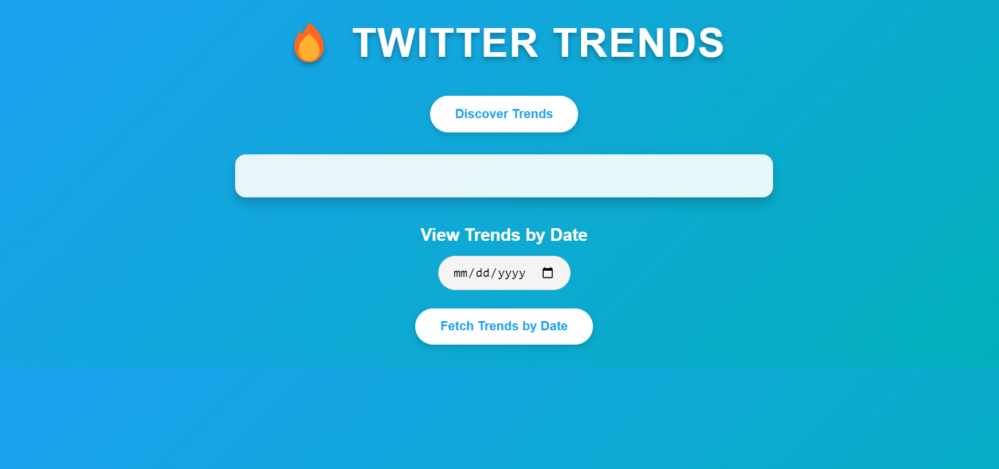
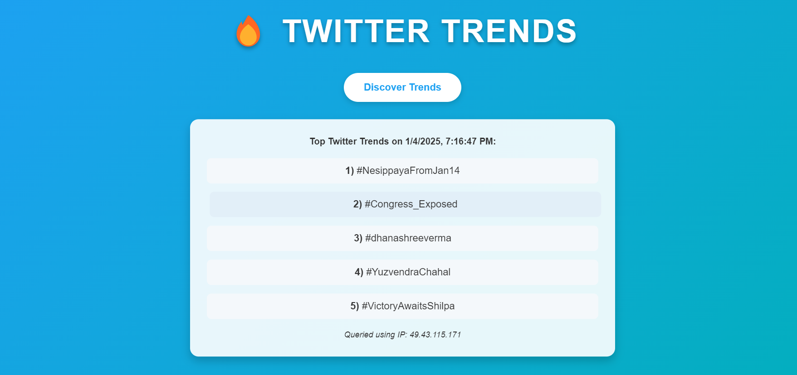

# 📈 TrendSniffer: Twitter Trend Scraper

TrendSniffer is a Python-based Twitter trend scraper that extracts real-time trending topics from Twitter using Selenium and displays them in a web interface powered by Flask.



---

## 🚀 Features

- **📊 Real-Time Trend Scraping:** Fetches the latest trending topics from Twitter.
- **🌐 Web Interface:** User-friendly web interface built with Flask.
- **🤖 Automated Browsing:** Automates data extraction using Selenium.
- **🖼️ Modern UI:** Clean and minimalistic design.

---

## 📂 Project Structure

```
TrendSniffer-twitter-trend-scraper/
├── images/
│   ├── twitter_logo.png
│   ├── homepage_screenshot.png
│   ├── latest_trend_screenshot.png
│   └── demo_video.mp4
├── templates/
│   └── index.html
├── .gitignore
├── app.py
├── requirements.txt
└── selenium_script.py
```

- **`images/`**: Contains image assets and demo video used in the web interface.
- **`templates/`**: Holds HTML templates for the Flask web server.
- **`app.py`**: Flask application handling the web interface.
- **`selenium_script.py`**: Selenium script for scraping Twitter trends.
- **`requirements.txt`**: Contains all the required Python packages.

---

## 📸 Visuals

### Homepage View


### Latest Trends View


### Demo Video


https://github.com/user-attachments/assets/a1504569-64b2-4af1-b506-20f43ebba7d5


---

## 📥 Installation

1. **Clone the Repository:**

   ```bash
   git clone https://github.com/mohitsinghgarry/TrendSniffer-twitter-trend-scrapper.git
   cd TrendSniffer-twitter-trend-scrapper
   ```

2. **Create and Activate a Virtual Environment:**

   ```bash
   python -m venv venv
   source venv/bin/activate  # For Windows: .\venv\Scripts\activate
   ```

3. **Install Dependencies:**

   ```bash
   pip install -r requirements.txt
   ```

---

## 📈 Usage

1. **Run the Selenium Script to Scrape Trends:**

   ```bash
   python selenium_script.py
   ```

2. **Start the Flask Application:**

   ```bash
   python app.py
   ```

3. **Access the Web App:**

   Open your browser and navigate to: `http://127.0.0.1:5000/`

---

## 📦 Dependencies

- **Python 3.6+**
- **Flask**
- **Selenium**
- **Google Chrome** & **ChromeDriver**

---

## 🛠️ Contributing

Contributions are welcome! Feel free to open issues or submit pull requests.

---

## 📜 License

This project is licensed under the MIT License. See the [LICENSE](LICENSE) file for details.

---

## 🌟 Show Your Support!

If you find this project useful, please ⭐ the repository!

---


